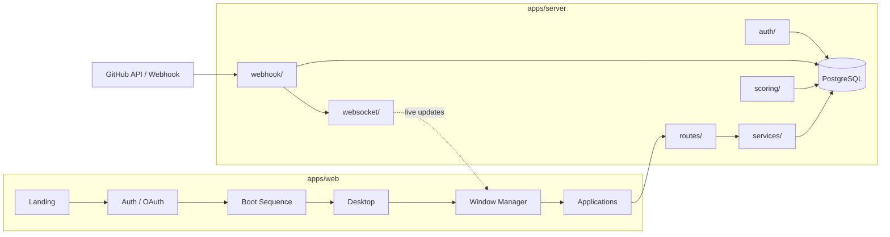

<div align="center">

     💫 O N Y X — DevOS
### Engineering Workstation

**Retro look. Modern power. Zero noise.**
<p align="center"><a href="./LICENSE"></a> <a href="#05--architecture"></a></p>

---

## `01` · Overview

**ONYX** is not just another GitHub dashboard. ONYX is an **operating system built for engineering teams** — complete with a boot screen, desktop, window manager, terminal, and modular applications (*Repository, Pull Requests, Reviews, Insights, Team, Reports, Heatmap*) that all run **in real time** through GitHub webhooks.

<div align="center">


</div>

---

## `02` · Philosophy

> **Zero AI. Zero heavy compute. Just facts from your git data.**

No AI API key to buy, no subscription to an LLM. Every insight (*Bus Factor, Review Health, Commit Decay,* and more) is computed **statistically** from your own git data — not "analyzed" by a language model. Clone it, run it, free forever.

---

## `03` · Features

| Module | Description |
|---|---|
| `DESKTOP` | Not a page — a window. Open multiple applications at once, drag, resize, snap into layout |
| `LIVE SYNC` | Every piece of data stays connected in real time via GitHub webhooks + WebSocket, no manual refresh |
| `INSIGHTS` | Bus Factor, Review Health, Commit Decay, Stale Radar, Reciprocity Gap, Weekend Heatmap |
| `COMMAND PALETTE` | `Ctrl+K` for power users — open apps, jump to a PR, copy a link, export, all without touching the mouse |
| `THEME ENGINE` | Three visual themes: CRT (retro), Modern, Pixel |
| `AUTH` | Native GitHub OAuth — log in and authorize repositories directly, no separate account |

---

## `04` · Preview

<details open>
<summary><strong>Full Feature Preview</strong></summary>
<br>


</details>

<details>
<summary><strong>Desktop — Connected Repository View</strong></summary>
<br>


</details>

---

## `05` · Architecture



**Product flow:** `landing → auth → boot → desktop → window-manager → taskbar → applications`

Every GitHub event (push, PR, review, issue, check run) arrives through `webhook/`, has its signature verified, gets persisted to `db/`, has its score recalculated in `scoring/`, and is broadcast in real time to every client currently viewing that repository through `websocket/` — no polling, no manual refresh.

---

## `06` · Tech Stack

| Layer | Technology |
|---|---|
| Frontend | Vite · React · TypeScript |
| Backend | Express · TypeScript |
| Database | PostgreSQL · [Drizzle ORM](https://orm.drizzle.team/) |
| Realtime | [Socket.IO](https://socket.io/) |
| Auth | GitHub OAuth 2.0 · JWT (access + refresh) · CSRF double-submit cookie |
| Deployment | Vercel (web) · Railway (server + db) |

<details>
<summary><strong>Project Structure</strong></summary>

```
server/src/
├── auth/            # GitHub OAuth, JWT, session, CSRF, permission/role
├── db/              # Drizzle schema, migrations, queries, seed
├── routes/          # REST endpoints per domain (dashboard, repository, PRs, reviews, etc.)
├── scoring/         # Statistical engine: busFactor, reviewHealth, commitDecay, etc.
├── services/        # GitHub API client, cache, analytics, storage, logger
├── webhook/         # Verify signature → parse → dispatch → onPush/onPullRequest/etc.
├── websocket/       # Socket.IO server: rooms, broadcast, heartbeat, notifications
└── index.ts         # Entrypoint: auto-migrate → listen

web/src/
├── auth/            # OAuth callback, repository authorization, auth guard
├── boot/            # Boot sequence, shutdown/restart screen
├── landing/         # Public marketing page before login
├── window-manager/  # Window frame, drag/resize/snap, menu bar
├── websocket/       # Socket client, provider, event subscription hook
├── theme/           # Design tokens + 3 themes (CRT / Modern / Pixel)
├── shared/          # Components, hooks, API client, types, utils shared across apps
└── App.tsx / main.tsx / router.tsx / index.css
```
</details>

> The tree above only covers what's implemented so far. The full planned structure (including `applications/`, `taskbar/`, `terminal/`, `desktop/`, and more) lives in [`struktur.md`](./struktur%20awal.md).

> 📌 Full structure (including `applications/`, `taskbar/`, `terminal/`, etc.) is documented in [`struktur awal.md`](./struktur%20awal.md).

---

## `07` · Getting Started

### Prerequisites

- Node.js ≥ 20
- PostgreSQL (local, Docker, or cloud such as [Neon](https://neon.tech))
- A [GitHub OAuth App](https://github.com/settings/developers)

### Clone & install

```bash
git clone https://github.com/GSF-001/ONYX-DevOS.git
cd ONYX-DevOS
npm install
```

### Environment variables

```bash
cp apps/server/.env.example apps/server/.env
```

| Variable | Description |
|---|---|
| `DATABASE_URL` | PostgreSQL connection string |
| `GITHUB_CLIENT_ID` / `GITHUB_CLIENT_SECRET` | From the OAuth App you created |
| `GITHUB_CALLBACK_URL` | `http://localhost:4000/auth/github/callback` for local dev |
| `JWT_ACCESS_SECRET` / `JWT_REFRESH_SECRET` | Any long random string |
| `APP_URL` | Frontend URL, `http://localhost:5173` for local dev |

Database schema is created/synced automatically on server start — no manual migration command needed.

### Run

```bash
npm run dev
```

| Service | URL |
|---|---|
| Web | http://localhost:5173 |
| API | http://localhost:4000 |

---

## `08` · Roadmap

| Status | Milestone |
|:---:|---|
| `DONE` | Auth — GitHub OAuth, JWT, session, CSRF |
| `DONE` | Database schema + auto-migration |
| `DONE` | Webhook pipeline (verify → parse → dispatch → handlers) |
| `DONE` | WebSocket real-time layer |
| `PLANNED` | Scoring engine (Bus Factor, Review Health, Commit Decay, etc.) |
| `PLANNED` | REST routes (dashboard, repository, PRs, reviews, insights, etc.) |
| `PLANNED` | Landing page |
| `PLANNED` | Boot sequence + Desktop + Window Manager |
| `PLANNED` | Applications (Dashboard, Repository, PRs, Reviews, Issues, Insights, Team, Reports, Heatmap, Terminal) |
| `PLANNED` | Command Palette (`Ctrl+K`) |
| `PLANNED` | Settings (theme switcher: CRT / Modern / Pixel) |

Detailed progress is tracked in [Issues](../../issues) and [Projects](../../projects).

Detailed progress is tracked in [Issues](../../issues) and [Projects](../../projects).

---

## `09` · Contributing

Contributions are welcome — read [`CONTRIBUTING.md`](./CONTRIBUTING.md) *(coming soon)* before opening a PR.

```
1. Fork this repository
2. git checkout -b feature/your-feature-name
3. git commit -m "feat: add your-feature-name"
4. Push & open a Pull Request
```

---

## Links

| | |
|---|---|
| Documentation | [`/docs`](./docs) |
| Report a Bug | [Issues](../../issues) |
| Roadmap / Project Board | [Projects](../../projects) |
| Discussions | [Discussions](../../discussions) |
| License | [`LICENSE`](./LICENSE) |

---

## License

Released under the **MIT License** — use, fork, and modify freely. See [`LICENSE`](./LICENSE) for full details.

<div align="center">
<sub>Built with ☕ and a love for pixel fonts.</sub>
</div>
