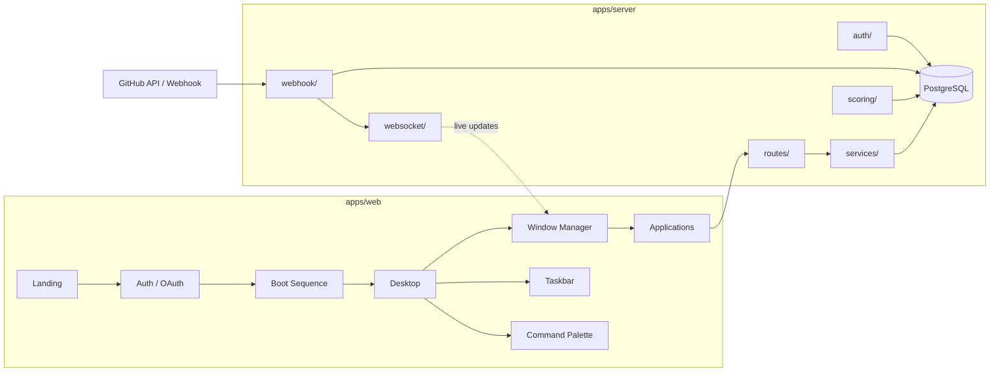

<div align="center">

   
      💫 ONYX — DevOS 
      Engineering Workstation for GitHub
 
 [ Engineering Workstation ]
**Retro look. Modern power. Zero noise.**

```
BOOT
   ↓
CONNECT
   ↓
WORK
```

**The engineering workstation for GitHub.**

</div>

<p align="center"><a href="./LICENSE"></a> <a href="#05--architecture"></a></p>

---

## `01` · Overview

**ONYX** is not just another GitHub dashboard. ONYX is an **operating system built for engineering teams** — complete with a boot screen, desktop, window manager, terminal, and modular applications that all run **in real time** through GitHub webhooks.

<div align="center">

  ##### ONYX Preview


</div>

---

## `02` · Philosophy

> **Zero AI. Zero heavy compute. Just facts from your git data.**

No AI API key to buy, no subscription to an LLM. Every insight (*Bus Factor, Review Health, Commit Decay,* and more) is computed **statistically** from your own git data — not "analyzed" by a language model. Clone it, run it, free forever.

---

## `03` · Features

| Module | Description |
|---|---|
| `DESKTOP` | Not a page — a window. Open multiple applications at once, drag, resize, snap into layout |
| `LIVE SYNC` | Every piece of data stays connected in real time via GitHub webhooks + WebSocket, no manual refresh |
| `INSIGHTS` | Bus Factor, Review Health, Commit Decay, Issue Graveyard, Reviewer Gap, Weekend Heatmap |
| `COMMAND PALETTE` | `Ctrl+K` for power users — open apps, jump to a PR, copy a link, export, all without touching the mouse |
| `THEME ENGINE` | Multiple visual themes: CRT (retro), Modern, Pixel, Dark |
| `AUTH` | Native GitHub OAuth — log in and authorize repositories directly, no separate account |
| `IDENTITY` | Auto-generated avatar identity per user, with cooldown-based regeneration |
| `SOUND` | Full UI sound system — boot, clicks, drag/drop, window events, notifications |
| `TERMINAL` | In-desktop terminal with command parser, autocomplete, and history |
| `WHITEBOARD` | Infinite canvas with layers, snapping, guides, and shape templates |
| `WORKFLOW` | Node-based flow builder with simulation/debugger support |
| `COMMUNITY / GROUPS` | Social layer — discussions, leaderboards, showcases, public/private groups |

---

## `04` · Preview

<details open>
<summary><strong>Full Feature Preview</strong></summary>
<br>


</details>

<details>
<summary><strong>Desktop — Connected Repository View</strong></summary>
<br>

   

</details>

---

## `05` · Architecture


```mermaid
flowchart LR
    subgraph Client["apps/web"]
        L[Landing] --> A[Auth / OAuth]
        A --> B[Boot Sequence]
        B --> D[Desktop]
        D --> WM[Window Manager]
        D --> TB[Taskbar]
        D --> CP[Command Palette]
        WM --> APP[Applications]
    end

    subgraph Server["apps/server"]
        AUTH[auth/] --> DB[(PostgreSQL)]
        WH[webhook/] --> DB
        WH --> WS[websocket/]
        SC[scoring/] --> DB
        RT[routes/] --> SVC[services/]
        SVC --> DB
    end

    GH[GitHub API / Webhook] --> WH
    WS -.live updates.-> WM
    APP --> RT
```

**Product flow:** `landing → auth → boot → desktop → window-manager → taskbar → applications`

Every GitHub event (push, PR, review, issue, check run) arrives through `webhook/`, has its signature verified, gets persisted to `db/`, has its score recalculated in `scoring/`, and is broadcast in real time to every client currently viewing that repository through `websocket/` — no polling, no manual refresh.

---

## `06` · Tech Stack

| Layer | Technology |
|---|---|
| Frontend | Vite · React · TypeScript |
| Backend | Express · TypeScript |
| Database | PostgreSQL · [Drizzle ORM](https://orm.drizzle.team/) |
| Realtime | [Socket.IO](https://socket.io/) |
| Auth | GitHub OAuth 2.0 · JWT (access + refresh) · CSRF double-submit cookie |
| Deployment | Vercel (web) · Railway (server + db) |

<details>
<summary><strong>Project Structure</strong></summary>

```
server/src/
├── auth/            # GitHub OAuth, JWT, session, CSRF, permission/role
├── db/              # Drizzle schema, migrations, queries, seed
├── routes/          # REST endpoints per domain (dashboard, repository, PRs, reviews, etc.)
├── scoring/         # Statistical engine: busFactor, reviewHealth, commitDecay, etc.
├── services/        # GitHub API client, cache, analytics, storage, logger
├── webhook/         # Verify signature → parse → dispatch → onPush/onPullRequest/etc.
├── websocket/       # Socket.IO server: rooms, broadcast, heartbeat, notifications
└── index.ts         # Entrypoint: auto-migrate → listen

web/src/
├── App.tsx / main.tsx / router.tsx / index.css
├── applications/     # Every desktop app, each self-contained (API, store, hooks, styles, window)
│   ├── Activity/         # Live feed, timeline, filters
│   ├── Community/        # Discussions, leaderboard, showcase, trending
│   ├── Dashboard/        # Overview, quick launch, insight feed, connect-repo modal
│   ├── GitGraph/         # Branch/commit topology visualizer
│   ├── Groups/           # Public/private groups, chat, files, announcements
│   ├── Heatmap/          # Commit / review / weekend heatmaps
│   ├── Insights/         # Bus Factor, Commit Decay, Review Health, Reviewer Gap
│   ├── Issues/           # Open/closed issues, labels, milestones, assignees
│   ├── Profile/
│   ├── PullRequests/     # Open/draft/merged/closed PRs, risk analysis, timeline
│   ├── Reports/          # Weekly/monthly/quarterly, CSV & PDF export
│   ├── Repository/       # Branches, commits, contributors, releases, tags
│   ├── Reviews/          # Review queue, reviewer load, timeline
│   ├── Settings/         # Appearance, keyboard, sound, workspace, integrations
│   ├── Team/             # Bus factor, contribution, leaderboard, reviewer load
│   ├── Terminal/         # Command console with parser & history
│   ├── Whiteboard/       # Infinite canvas: layers, guides, snapping, templates
│   └── Workflow/         # Node-based flow builder + simulation/debugger
├── assets/           # Icons, mascot art, boot imagery
├── audio/            # SoundManager + per-event sound modules
├── auth/             # OAuth callback, repository authorization, auth guard
├── boot/             # Boot sequence, shutdown/restart screens
├── command-palette/  # Ctrl+K palette, command list & search
├── cursor/           # Custom cursor themes & effects
├── desktop/          # Desktop context menu
├── icons/            # App icon set
├── identity/         # Auto-generated user identity/avatar system
├── landing/          # Public marketing page before login
├── mascot/           # Animated mascot states (idle, happy, error, etc.)
├── notifications/    # Toasts, alerts, live PR/issue/review notifications
├── pages/            # Route-level pages (desktop, features, 404)
├── shared/           # API client, components, hooks, types, utils shared across apps
├── taskbar/          # Clock, tray, quick launch, system status, start menu
├── terminal/          # Lower-level terminal engine (parser, registry, history)
├── theme/            # Design tokens + themes (CRT / Modern / Pixel / Dark)
├── websocket/        # Socket client, provider, event subscription hook
├── window-manager/   # Window frame, drag/resize/snap, focus, z-index, shortcuts
└── workspace-setup/  # Create workspace & repository setup flow
```
</details>

> Structure above reflects the current state of `apps/web`. Some applications are scaffolded end-to-end (components, store, hooks, API layer) but not yet fully wired to live backend data — see Roadmap below.

---

## `07` · Getting Started

### Prerequisites

- Node.js ≥ 20
- PostgreSQL (local, Docker, or cloud such as [Neon](https://neon.tech))
- A [GitHub OAuth App](https://github.com/settings/developers)

### Clone & install

```bash
git clone https://github.com/GSF-001/ONYX-DevOS.git
cd ONYX-DevOS
npm install
```

### Environment variables

```bash
cp apps/server/.env.example apps/server/.env
```

| Variable | Description |
|---|---|
| `DATABASE_URL` | PostgreSQL connection string |
| `GITHUB_CLIENT_ID` / `GITHUB_CLIENT_SECRET` | From the OAuth App you created |
| `GITHUB_CALLBACK_URL` | `http://localhost:4000/auth/github/callback` for local dev |
| `JWT_ACCESS_SECRET` / `JWT_REFRESH_SECRET` | Any long random string |
| `APP_URL` | Frontend URL, `http://localhost:5173` for local dev |

Database schema is created/synced automatically on server start — no manual migration command needed.

### Run

```bash
npm run dev
```

| Service | URL |
|---|---|
| Web | http://localhost:5173 |
| API | http://localhost:4000 |

---

## `08` · Roadmap

| Status | Milestone |
|:---:|---|
| `DONE` | Auth — GitHub OAuth, JWT, session, CSRF |
| `DONE` | Database schema + auto-migration |
| `DONE` | Webhook pipeline (verify → parse → dispatch → handlers) |
| `DONE` | WebSocket real-time layer |
| `DONE` | Boot sequence + Desktop + Window Manager |
| `DONE` | Taskbar + Command Palette (`Ctrl+K`) |
| `DONE` | Theme engine (CRT / Modern / Pixel / Dark) |
| `DONE` | Application shells scaffolded (Dashboard, Repository, PRs, Reviews, Issues, Insights, Team, Reports, Heatmap, Terminal, Activity, Community, Groups, Whiteboard, Workflow, GitGraph, Settings, Profile) |
| `IN PROGRESS` | Scoring engine (Bus Factor, Review Health, Commit Decay, etc.) wired to live data |
| `IN PROGRESS` | REST routes (dashboard, repository, PRs, reviews, insights, etc.) |
| `PLANNED` | Full end-to-end data wiring for every application module |
| `PLANNED` | Reports export (CSV / PDF) |
| `PLANNED` | Public launch / hosted demo |

Detailed progress is tracked in [Issues](../../issues)

---

## `09` · Contributing

Contributions are welcome — read [`CONTRIBUTING.md`](./CONTRIBUTING.md) *(coming soon)* before opening a PR.

```
1. Fork this repository
2. git checkout -b feature/your-feature-name
3. git commit -m "feat: add your-feature-name"
4. Push & open a Pull Request
```

---

## Links

| | |
|---|---|
| Documentation | [`/docs`](./docs) |
| Report a Bug | [Issues](../../issues) |
| Roadmap / Project Board | [Projects](../../projects) |
| Discussions | [Discussions](../../discussions) |
| License | [`LICENSE`](./LICENSE) |

---

## License

Released under the **MIT License** — use, fork, and modify freely. See [`LICENSE`](./LICENSE) for full details.

<div align="center">
<sub>Built with ☕ and a love for pixel fonts.</sub>
</div>
